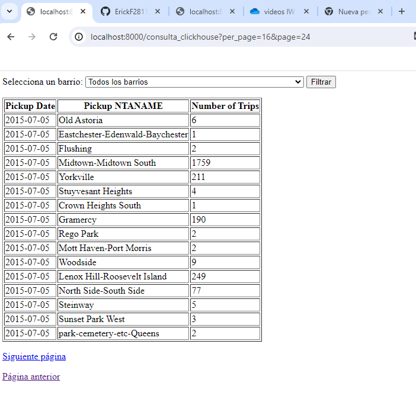

Entendido. Voy a relacionar cada componente con los requerimientos establecidos sin repetir el código.

## Uso

1. Clona este repositorio.
### Ejecucion de programa 
1. Ejecuta `docker-compose build` para levantar los servicios.

2. Ejecuta `docker-compose up -d` para levantar los servicios.
3. Accede a `http://localhost:8000/` para interactuar con el API del microservicio.
3. Accede a `http://localhost:8000/consulta_clickhouse` para interactuar con el API del microservicio mostrando la base de datos clickhouse.
Nota: esperar unos segundos que se descarge toda la base de datos al iniciar el click house

## Video demostrativo 
`https://espolec-my.sharepoint.com/:v:/g/personal/erifcamp_espol_edu_ec/ER-gVhQlpfpFiLWyyVh9_XsBSx9vL3Y7mHOQRZNTl5BfvQ?nav=eyJyZWZlcnJhbEluZm8iOnsicmVmZXJyYWxBcHAiOiJPbmVEcml2ZUZvckJ1c2luZXNzIiwicmVmZXJyYWxBcHBQbGF0Zm9ybSI6IldlYiIsInJlZmVycmFsTW9kZSI6InZpZXciLCJyZWZlcnJhbFZpZXciOiJNeUZpbGVzTGlua0NvcHkifX0&e=mIRKZX`

### 1. ClickHouse

El servicio ClickHouse se configura en el archivo `docker-compose.yml`, donde se especifica la imagen a utilizar y se mapean los puertos 8123 y 9000 para la comunicación. Además, se utiliza un volumen para cargar el script SQL que inicializa la base de datos.

### 2. Cargar datos de ejemplo

El script SQL `script.sql` contiene las instrucciones para crear la tabla `trips` en ClickHouse y cargar los datos de ejemplo. Esta tabla se utiliza para almacenar información sobre viajes.

### 3. Microservicio con FastAPI

El archivo `Dockerfile` contiene las instrucciones para construir el contenedor del microservicio FastAPI. Se especifican las dependencias necesarias y se copian los archivos del microservicio al contenedor.
#### Actividad programada
El microservicio implementa una actividad programada para enviar el total de registros de la tabla `trips` a un grupo de Telegram cada quince minutos, como se indica en los requerimientos. Esta funcionalidad se encuentra en el archivo `main.py`.

### 4. API REST del microservicio

El archivo `main.py` contiene el código del microservicio FastAPI. Define los endpoints del API REST, incluyendo la consulta de carreras realizadas y el número diario de recogidas por barrio, como se solicita en los requerimientos.

### 5. Manejo adecuado de secretos y datos sensibles

Se debe tener especial cuidado en el manejo de secretos y datos sensibles en la implementación. Esto implica asegurar que las credenciales y otros datos confidenciales estén protegidos y no se expongan accidentalmente.

